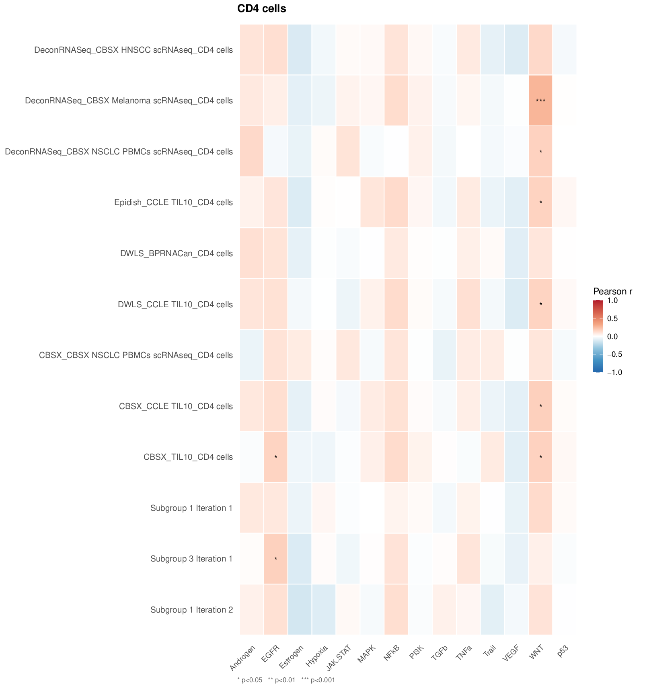

# Cell type subgroup analysis

``` r

library(multideconv)
```

## **Cell type processing**

Deconvolution analysis reduces the dimensionality and heterogeneity of
the deconvolution results. It uses the cell type processing algorithm
described in the paper [Hurtado et al.,
2025](https://www.biorxiv.org/content/10.1101/2025.04.29.651220v2.article-info).
It returns the cell type subgroups composition and the reduced
deconvolution matrix, saved in the `Results/` directory.

Within each cell type, features (method-signature estimates) are grouped
by complete-linkage hierarchical clustering of their correlations:
features form a subgroup only if **every pair** of them correlates at
least `corr` (non-significant correlations count as 0). Each subgroup is
summarised by the median of its members. The result does not depend on
the order of the columns.

Key parameters:

- **deconvolution**: Matrix of raw deconvolution results (output of
  [`compute.deconvolution()`](https://verapancaldilab.github.io/multideconv/reference/compute.deconvolution.md))
- **corr**: Minimum correlation threshold to group features
- **return**: Whether to return results and save output files to the
  `Results/` directory
- **batch**: Optional factor vector of cohort/batch labels (see section
  below on batch correction)

``` r

deconv_bulk = multideconv::deconv_bulk
deconv_subgroups = compute.deconvolution.analysis(deconvolution = deconv_bulk,
                                                  corr = 0.7,
                                                  file_name = "Tutorial",
                                                  return = TRUE)
```

The result is a named list with six elements:

``` r

names(deconv_subgroups)
#> [1] "Deconvolution matrix"                        
#> [2] "Deconvolution subgroups per cell types"      
#> [3] "Deconvolution subgroups composition"         
#> [4] "Discarded features with high number of zeros"
#> [5] "Discarded features with low variance"        
#> [6] "Discarded cell types"
```

Access the reduced deconvolution matrix (samples × subgroups):

``` r

head(deconv_subgroups[["Deconvolution matrix"]][, sample(ncol(deconv_subgroups[["Deconvolution matrix"]]), 5)])
#>                 DeconRNASeq_CBSX.Melanoma.scRNAseq_Endothelial
#> SAM7f0d9cc7f001                                      0.1247419
#> SAM4305ab968b90                                      0.1847182
#> SAMcf018fee2acd                                      0.1672997
#> SAMcc4675f394a1                                      0.2070710
#> SAM49f9b2e57aa5                                      0.1639431
#> SAM2e7aa8fa0ab3                                      0.1168617
#>                 DeconRNASeq_LM22_T.cells.helper CBSX_BPRNACanProMet_Neutrophils
#> SAM7f0d9cc7f001                      0.00000000                    0.0034759832
#> SAM4305ab968b90                      0.08389950                    0.0000000000
#> SAMcf018fee2acd                      0.00000000                    0.0029090514
#> SAMcc4675f394a1                      0.00000000                    0.0000000000
#> SAM49f9b2e57aa5                      0.06256773                    0.0000000000
#> SAM2e7aa8fa0ab3                      0.01772861                    0.0004672195
#>                 DeconRNASeq_CBSX.Melanoma.scRNAseq_CD4.cells
#> SAM7f0d9cc7f001                                   0.07161836
#> SAM4305ab968b90                                   0.07890048
#> SAMcf018fee2acd                                   0.07567607
#> SAMcc4675f394a1                                   0.07173726
#> SAM49f9b2e57aa5                                   0.07369131
#> SAM2e7aa8fa0ab3                                   0.05237417
#>                 CD4.cells_Subgroup.2
#> SAM7f0d9cc7f001           0.18051700
#> SAM4305ab968b90           0.00000000
#> SAMcf018fee2acd           0.19511491
#> SAMcc4675f394a1           0.06190600
#> SAM49f9b2e57aa5           0.15741680
#> SAM2e7aa8fa0ab3           0.07050168
```

Inspect subgroup composition (which methods/signatures were merged into
each subgroup):

``` r

deconv_subgroups[["Deconvolution subgroups composition"]]$B.cells
#> $B.cells_Subgroup.1
#> [1] "CBSX_BPRNACan_B.cells"            "CBSX_BPRNACan3DProMet_B.cells"   
#> [3] "CBSX_BPRNACanProMet_B.cells"      "DWLS_BPRNACan_B.cells"           
#> [5] "DWLS_BPRNACan3DProMet_B.cells"    "DWLS_BPRNACanProMet_B.cells"     
#> [7] "Epidish_BPRNACan_B.cells"         "Epidish_BPRNACan3DProMet_B.cells"
#> [9] "Epidish_BPRNACanProMet_B.cells"  
#> 
#> $B.cells_Subgroup.2
#> [1] "CBSX_CBSX.HNSCC.scRNAseq_B.cells"       
#> [2] "DeconRNASeq_CBSX.HNSCC.scRNAseq_B.cells"
#> [3] "DWLS_CBSX.HNSCC.scRNAseq_B.cells"       
#> [4] "Epidish_CBSX.HNSCC.scRNAseq_B.cells"    
#> 
#> $B.cells_Subgroup.3
#> [1] "CBSX_CBSX.Melanoma.scRNAseq_B.cells"   
#> [2] "DWLS_CBSX.Melanoma.scRNAseq_B.cells"   
#> [3] "Epidish_CBSX.Melanoma.scRNAseq_B.cells"
#> 
#> $B.cells_Subgroup.4
#> [1] "DeconRNASeq_BPRNACan_B.cells"        
#> [2] "DeconRNASeq_BPRNACan3DProMet_B.cells"
#> [3] "DeconRNASeq_BPRNACanProMet_B.cells"  
#> 
#> $B.cells_Subgroup.5
#> [1] "DeconRNASeq_CCLE.TIL10_B.cells" "DeconRNASeq_TIL10_B.cells"     
#> 
#> $B.cells_Subgroup.6
#> [1] "DWLS_CBSX.NSCLC.PBMCs.scRNAseq_B.cells"   
#> [2] "Epidish_CBSX.NSCLC.PBMCs.scRNAseq_B.cells"
deconv_subgroups[["Deconvolution subgroups composition"]]$Macrophages.M2
#> $Macrophages.M2_Subgroup.1
#> [1] "CBSX_BPRNACan_Macrophages.M2"           
#> [2] "CBSX_BPRNACanProMet_Macrophages.M2"     
#> [3] "DWLS_BPRNACan_Macrophages.M2"           
#> [4] "DWLS_BPRNACan3DProMet_Macrophages.M2"   
#> [5] "DWLS_BPRNACanProMet_Macrophages.M2"     
#> [6] "Epidish_BPRNACan_Macrophages.M2"        
#> [7] "Epidish_BPRNACan3DProMet_Macrophages.M2"
#> [8] "Epidish_BPRNACanProMet_Macrophages.M2"  
#> 
#> $Macrophages.M2_Subgroup.2
#> [1] "CBSX_LM22_Macrophages.M2"    "DWLS_LM22_Macrophages.M2"   
#> [3] "Epidish_LM22_Macrophages.M2"
#> 
#> $Macrophages.M2_Subgroup.3
#> [1] "DeconRNASeq_BPRNACan_Macrophages.M2"        
#> [2] "DeconRNASeq_BPRNACan3DProMet_Macrophages.M2"
#> [3] "DeconRNASeq_BPRNACanProMet_Macrophages.M2"  
#> 
#> $Macrophages.M2_Subgroup.4
#> [1] "DeconRNASeq_CCLE.TIL10_Macrophages.M2"
#> [2] "DeconRNASeq_TIL10_Macrophages.M2"     
#> 
#> $Macrophages.M2_Subgroup.5
#> [1] "DWLS_CCLE.TIL10_Macrophages.M2"    "Epidish_CCLE.TIL10_Macrophages.M2"
#> 
#> $Macrophages.M2_Subgroup.6
#> [1] "DWLS_TIL10_Macrophages.M2"    "Epidish_TIL10_Macrophages.M2"
deconv_subgroups[["Deconvolution subgroups composition"]]$Dendritic.cells
#> $Dendritic.cells_Subgroup.1
#> [1] "CBSX_CBSX.HNSCC.scRNAseq_Dendritic.cells"   
#> [2] "DWLS_CBSX.HNSCC.scRNAseq_Dendritic.cells"   
#> [3] "Epidish_CBSX.HNSCC.scRNAseq_Dendritic.cells"
```

If your deconvolution matrix contains non-standard cell types (see
README), specify them using `cells_extra` to ensure proper subgrouping.
If not specified, they will be discarded automatically.

``` r

deconv_subgroups = compute.deconvolution.analysis(deconvolution = deconv_pseudo,
                                                  corr = 0.7,
                                                  return = TRUE,
                                                  cells_extra = c("Mural.cells", "Myeloid.cells"),
                                                  file_name = "Tutorial")
```

## **Handling batch effects (multiple cohorts)**

When your samples come from multiple cohorts or batches, simple
Pearson/Spearman correlations can be confounded by cohort structure.
[`compute.deconvolution.analysis()`](https://verapancaldilab.github.io/multideconv/reference/compute.deconvolution.analysis.md)
accepts a `batch` argument that switches the internal correlation to
**partial correlation**, controlling for cohort membership in the
correlations used to build the subgroups.

The `batch` vector must be a factor or character vector with one label
per sample, in the same order as the rows of the deconvolution matrix
(names are not used).

``` r

# Example: 'cohort' has one label per sample ("CohortA" / "CohortB"), in the same order as rownames(deconv_bulk)
cohort <- c(rep("CohortA", 96), rep("CohortB", 96))

deconv_subgroups_batch = compute.deconvolution.analysis(
  deconvolution = deconv_bulk,
  corr          = 0.7,
  batch         = cohort,
  file_name     = "Tutorial_batch",
  return        = TRUE
)
```

When `batch` is supplied:

- Correlations between features are **partial correlations** that remove
  the batch effect (via
  [`ppcor::pcor.test()`](https://rdrr.io/pkg/ppcor/man/pcor.test.html),
  with one indicator per batch).
- Subgroups are built from these partial correlations, so inter-cohort
  differences do not inflate feature similarity.

This approach is recommended whenever samples originate from distinct
studies, sequencing runs, or processing pipelines, as it prevents
cohort-specific signals from being mistaken for biologically meaningful
co-variation.

## **Characterizing subgroups with pathway activities**

Once subgroups are identified, you can interpret their biological
meaning by correlating each subgroup’s abundance profile across samples
with pathway activity scores. The function
[`compute.subgroup.pathways()`](https://verapancaldilab.github.io/multideconv/reference/compute.subgroup.pathways.md)
generates one heatmap per cell type showing how each subgroup correlates
with each pathway.

[`compute.subgroup.pathways()`](https://verapancaldilab.github.io/multideconv/reference/compute.subgroup.pathways.md)
expects a **pre-computed** sample × pathway numeric matrix. As an
example, we are going to compute pathway activities using the
**PROGENy** database (Schubert et al., 2018), making use of the package
[CellTFusion](https://github.com/VeraPancaldiLab/CellTFusion). PROGENy
models the activity of 14 cancer-relevant signalling pathways from gene
expression data.

> Schubert, M., Klinger, B., Klünemann, M., Sieber, A., Uhlitz, F.,
> Sauer, S., Garnett, M. J., Blüthgen, N., & Saez-Rodriguez, J. (2018).
> Perturbation-response genes reveal signaling footprints in cancer gene
> expression. *Nature Communications*, 9(1), 20.
> <https://doi.org/10.1038/s41467-017-02391-6>

``` r

# Install CellTFusion if needed (once):
# pak::pkg_install("VeraPancaldiLab/CellTFusion")
library(CellTFusion)

counts     <- multideconv::raw_counts
counts_tpm <- ADImpute::NormalizeTPM(counts, log = FALSE)

# compute.pathway.activity() returns a sample x pathway activity matrix
pathway_scores <- compute.pathway.activity(counts_tpm)

compute.subgroup.pathways(
  subgroups = deconv_subgroups,
  pathways  = pathway_scores,
  file_name = "Tutorial",
  pval      = 0.05
)
```

Any other sample × pathway matrix (e.g. from GSVA, ssGSEA, or decoupleR)
can be passed as `pathways` in the same way.

One PDF heatmap per cell type is saved to `Results/`. The function also
returns (invisibly) a list with the correlations and p-values of each
cell type, and `corr_type` selects Pearson (default) or Spearman
correlations. Below is an example output for CD4 T cells (12 subgroups ×
14 PROGENy pathways), where stars indicate significance levels (\*
p\<0.05, \*\* p\<0.01, \*\*\* p\<0.001):



## **Replicate deconvolution subgroups in an independent set**

Cell subgroup identification through deconvolution is cohort-specific,
as it relies on correlation patterns across samples. This means that
subgroup definitions may vary across different splits or datasets. If
you aim to replicate the same subgroups identified in one dataset onto
another (e.g., for model validation), you can use the following
function.

The function below reconstructs and applies the subgroup signatures
derived from a previous deconvolution, making it especially useful when
transferring learned patterns across datasets — such as when training
and evaluating machine learning models.

``` r

deconv_1 = deconv_bulk[1:100,]
deconv_2 = deconv_bulk[101:192,]

deconv_subgroups = compute.deconvolution.analysis(deconvolution = deconv_1,
                                                  corr = 0.7,
                                                  file_name = "Tutorial",
                                                  return = FALSE)
deconv_subgroups_replicate = replicate_deconvolution_subgroups(deconv_subgroups,
                                                               deconv_2)
```
