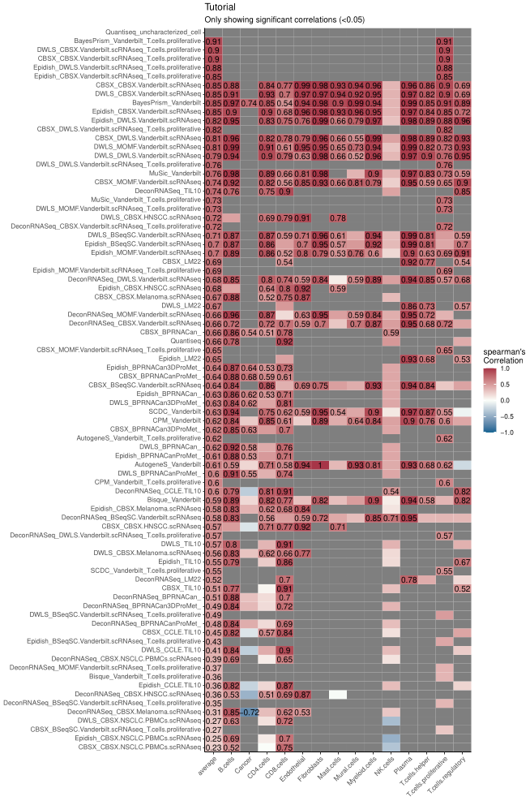

# Pseudo-bulk profiles and benchmarking

``` r
library(multideconv)
metacell_obj = multideconv::metacells_data
metacell_metadata = multideconv::metacells_metadata
```

## **Pseudo-bulk profiles**

To create pseudo-bulk profiles from the original single-cell objects,
simulating a bulk RNA-seq dataset, you can use the following function:

**NOTE:** You can input either your original single-cell object or the
metacell object. Just be sure to select the same object when examining
the real cell proportions (if needed).

``` r
metacells_seurat = Seurat::CreateSeuratObject(metacell_obj, meta.data = metacell_metadata)
#> Warning: Data is of class matrix. Coercing to dgCMatrix.
pseudobulk = create_sc_pseudobulk(metacells_seurat, cells_labels = "annotated_ct", sample_labels = "sample", normalized = TRUE, file_name = "Tutorial")
#> Warning: Layer 'data' is empty
#> Warning: Layer 'scale.data' is empty
#> Aggregating assay 'counts' using 'rowMeans2'.
#> Converting input to matrix.
```

## **Creating cell type signatures**

To create cell type signatures, `multideconv` uses four methods:
`CIBERSORTx`, `DWLS`, `MOMF`, and `BSeq-SC`. You must provide
single-cell data as input. Signatures are saved in the
`Results/custom_signatures` directory, and returned as a list. From now
and after
[`compute.deconvolution()`](https://verapancaldilab.github.io/multideconv/reference/compute.deconvolution.md)
will use these signatures additionally to the default ones! So if you
would like to have the deconvolution results based on your new files,
make sure to run
[`compute.deconvolution()`](https://verapancaldilab.github.io/multideconv/reference/compute.deconvolution.md)

To run `BSeq-SC`, supply the `cell_markers` argument, which should
contain the differential markers for each cell type (these can be
obtained using `FindMarkers()` or `FindAllMarkers()` from Seurat).

``` r
bulk_pseudo = multideconv::pseudobulk
signatures = create_sc_signatures(metacell_obj, 
                                  metacell_metadata, 
                                  cells_labels = "annotated_ct", 
                                  sample_labels = "sample", 
                                  bulk_rna = bulk_pseudo, 
                                  cell_markers = NULL, 
                                  name_signature = "Test",
                                  methods_sig = c("DWLS", "CIBERSORTx", "MOMF", "BSeqsc"))
```

## **Cell types signatures benchmark**

To validate the generated signatures, we provide a benchmarking function
to compare deconvolution outputs against known cell proportions (e.g.,
from single-cell or imaging data). The `cells_extra` argument should
include any non-standard cell types present in your ground truth. Make
sure cell names match those in the deconvolution matrix (e.g., use
B.cells instead of B cells if that is the naming convention used - see
README for more information).

``` r
deconv_pseudo = multideconv::deconvolution
cells_groundtruth = multideconv::cells_groundtruth
benchmark = compute.benchmark(deconv_pseudo, 
                              cells_groundtruth, 
                              cells_extra = c("Mural.cells", "Myeloid.cells"), 
                              corr_type = "spearman",
                              scatter = FALSE, 
                              plot = TRUE, 
                              pval = 0.05, 
                              file_name = "Tutorial", 
                              width = 10, 
                              height = 15)
#> No id variables; using all as measure variables
#> No id variables; using all as measure variables
```



*Figure 1. Example of performance of different methods and signature
combinations on the pseudo bulk.*
